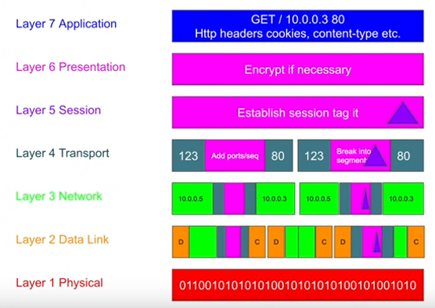

# How to establish a tcp/ip connection

## Server

Start one of the servers: 
tcp.js or tcp-debounce.js

```js
node tcp.js || node tcp-debounce.js
```

## On the terminal

```sh
    telnet localhost 8080
```

## Extra Resources

### OSI Model 



### TCP/IP Model

| Pros | Cons |
|------|------|
| Acknowledgement | Larget Packets |
| Guaranteed Delivery | More bandwidth |
| Connection based | Slower than udp |
| Congestion control | Stateful - Past data is destroyed, once connection closed |
| Ordered packets * | Server Memory (DOS) - Have to allocate memory for tcp connections|

Basically does too much and takes time, but is reliable.

### UDP/IP Model

UDP = User Datagram Protocol

| Pros | Cons |
|------|------|
| Faster than TCP | No Acknowledgement |
| none | No Guaranteed Delivery - Just picks and drops, no guaranteed delivery |
| Smaller Packets - as no extra stuff | Connectionless - No physical connection, so client doesn't know you, neither do you know them|
| Less Bandwidth - as smaller packets | No Congestion Control - Doesn't care if there is traffic, it doesn't wait traffic to clear up, it just delivers|
| Stateless - Server dies, the client can start back from where it left | No Ordered Packets|
| none | Security - Because no connection, the server doesn't really know who the guy is at the opposite end|

Basically does less and is faster, but not reliable.